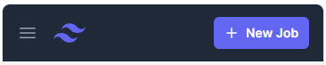

# S08E5 - Défi tailwindCSS

## Sujet

Salut à toi ! Tu t'apprêtes à décrocher le job de tes rêves et tu as déjà passé un entretien qui s'est très bien passé bravo.
Il te reste une dernière étape avant de recevoir une proposition : **Le test technique !**

On te demande de réaliser la navbar suivante en utilisant TailwindCSS

- **Version Mobile**
  
  


- **Version Desktop**
  


## Critères de réussites & infos :

- Tu réaliseras ce test directement sur : [https://play.tailwindcss.com/](https://play.tailwindcss.com/)
- Commence par la version mobile, si tu as le temps enchaîne sur le responsive en version desktop
- Ne te soucie pas de ce qu'il se passe quand on clique sur le menu burger ça ne fait pas partie du test.
- Si tu as le temps, ajoute un effet hover sur les différents liens et sur le bouton "New job"
- Essai de coller au mieux au screenshots, mais ne passe pas trop de temps sur les détails si c'est légèrement différent ce n'est pas grave


## Ressources & aides :
 - Les couleurs utilisées : `white`, `indigo-500`, `gray-900`, `gray-800`, `gray-300`,
 - La taille de police (mobile et desktop) : `text-sm` 
 - Le breakpoint pour la version desktop a utiliser : `sm:`
 - Logo dans le menu : 
  ```html
  
  ```
 - Icone menu burger :
 ```html
    <svg class="block h-6 w-6" fill="none" viewBox="0 0 24 24" stroke-width="1.5" stroke="currentColor" aria-hidden="true">
        <path stroke-linecap="round" stroke-linejoin="round" d="M3.75 6.75h16.5M3.75 12h16.5m-16.5 5.25h16.5" />
    </svg>
 ```
 - Image du personnage : [https://images.unsplash.com/photo-1472099645785-5658abf4ff4e?ixlib=rb-1.2.1&ixid=eyJhcHBfaWQiOjEyMDd9&auto=format&fit=facearea&facepad=2&w=256&h=256&q=80](https://images.unsplash.com/photo-1472099645785-5658abf4ff4e?ixlib=rb-1.2.1&ixid=eyJhcHBfaWQiOjEyMDd9&auto=format&fit=facearea&facepad=2&w=256&h=256&q=80)
 - Correction sur la branche correction du repo ;)